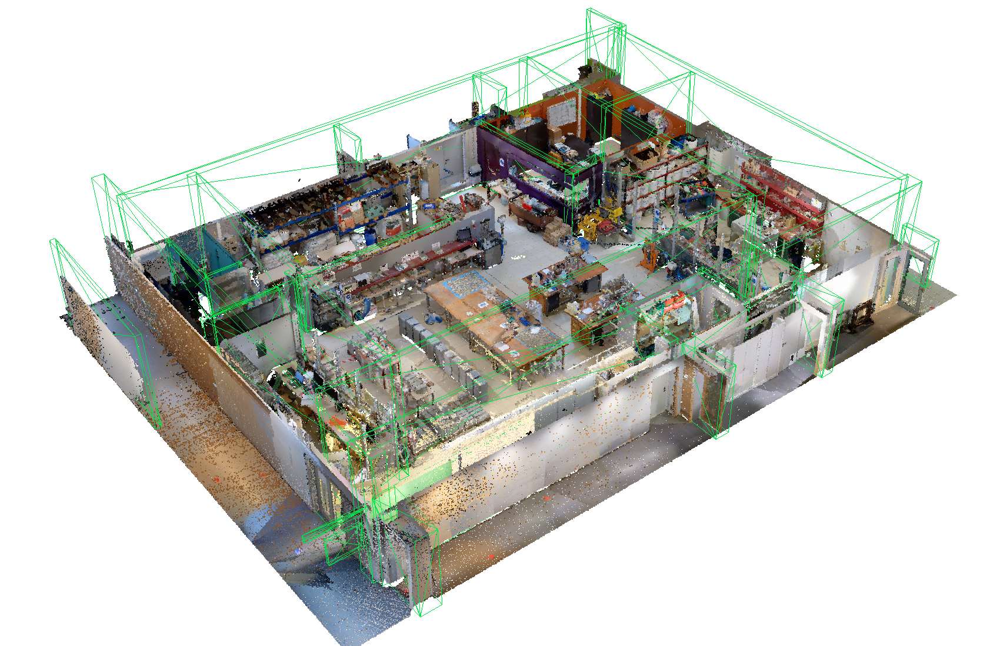
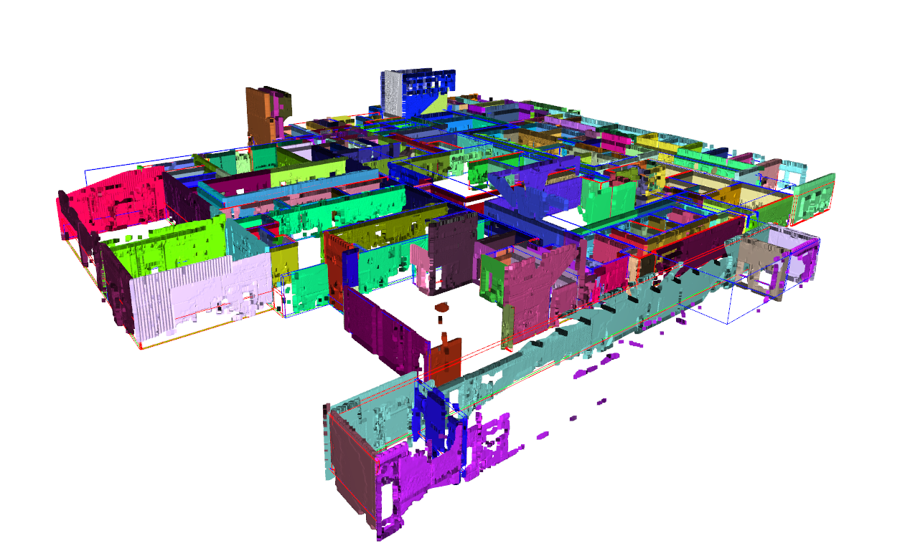
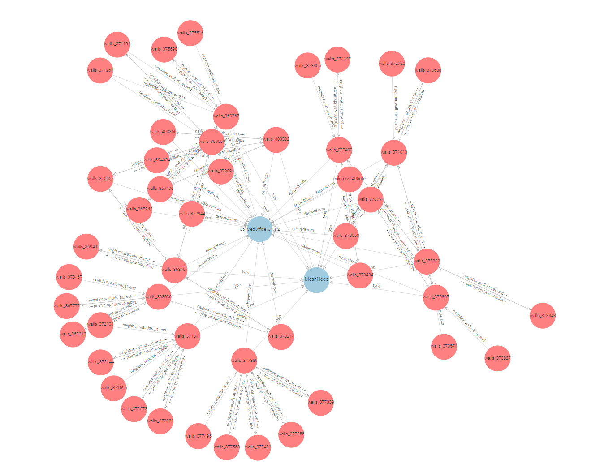
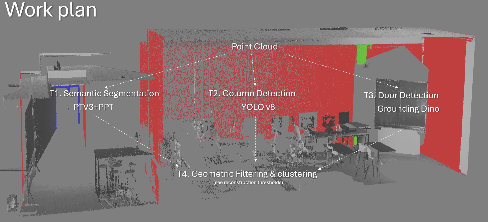
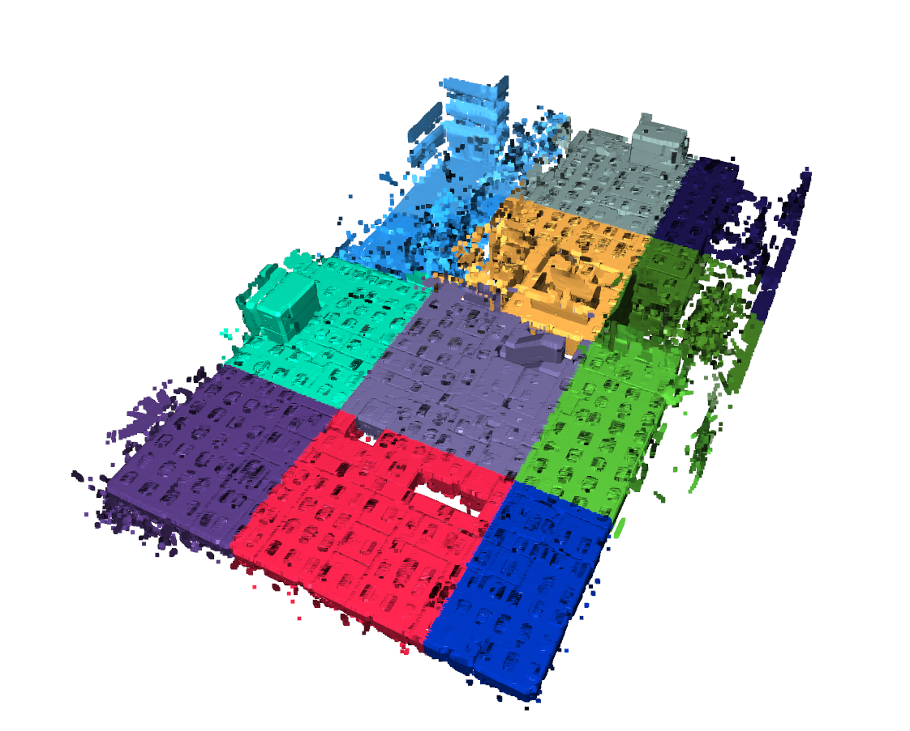
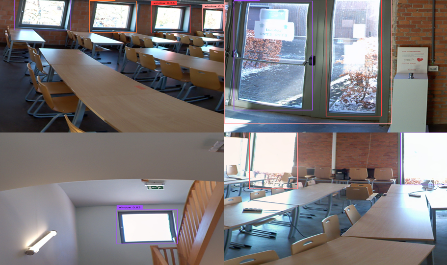
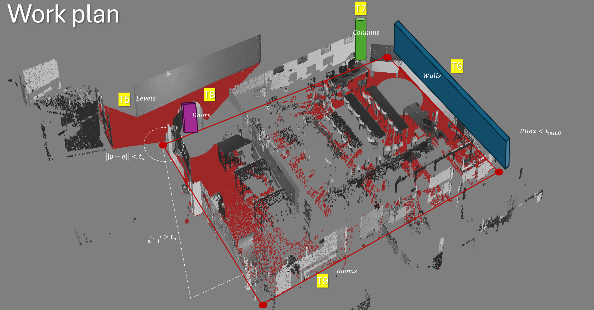
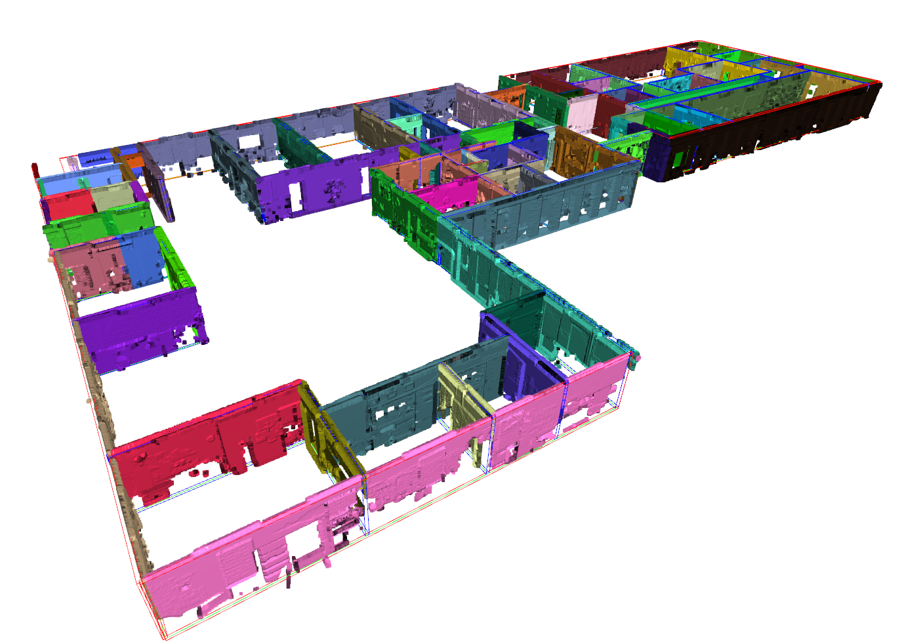

# Scan-to-BIM-CVPR-2024

This is the KUL and FBK repo for the [4th International Scan-to-BIM competition](https://cv4aec.github.io/) to reconstruct wall, column and door elements from point cloud data in public buildings. We split the process into three steps, a <strong>Preprocessing</strong> step (task 0), a <strong>Detection</strong> step (tasks 1-4) and a <strong>Reconstruction</strong> (tasks 5-9) step. In total, 10 tasks are defined. Each step is explained below.

        
        
Figure 1: Preprocessing result showing submeshes for each wall, column, and door element.</strong>.

## Preprocessing

The preprocessing includes subsampling the point cloud to 0.01m and parsing the training data jsons to triangle mesh objects. The result is an .obj with submeshes for each wall, column and door element (see Figure 1). Additionally, we segment the point clouds according to these elements to form the ground truth for the instance segmentation training (Figure 2). We also generate RDF graphs with metric metadata of each point cluster and link them to the BIM Objects so they can be tracked throughout the reconstruction process. Take a look at our [GEOMAPI](https://ku-leuven-geomatics.github.io/geomapi/) toolbox to read more about how this is done.

    

        
        
Figure 2: Segmented Point Cloud

    

    

        
        
Figure 3: RDF graph with Metadata properties

    

## Detection
In the detection step, we compute the instance segmentation of the primary (walls, ceilings, floors, columns) and secondary structure classes (doors). Two scalar field are assigned to the unstructured point clouds. First, a **class label** is computed for every point of the in total 7 classes (0.Floors, 1.Ceilings, 2. Walls, 3.Columns, 4.Doors, 5.beams, 255.Unassigned). Second, an **object label** is assigned to every point and a json is computed with the 3D information of the detected objects. 

        
        
Figure 4: Overview detection procedure.</strong>.

- **[T1. Semantic Segmentation](./scripts/t1_semantic_segmentation.ipynb)**: [PTV3+PPT](https://github.com/Pointcept/PointTransformerV3) is an excellent model for segmenting unstructured points clouds such as walls, ceilings and floors. This is confirmed in a validation using the partitioned training data with **mIoU**: 89.4 and **mAcc**: 91.6 over these classes. Theoretically, it should also work well for columns as they have distinct geometric signatures. However, columns are heavily occluded and only make up 0.7% of the scene (Table 1). With training results stagnating at 40%, we combined it with a vision approach in T2. The doors were expected to heavily underperform (42% mIoU with 0.9% representation) as they often represent vacuums instead of geometry and have a poor geometric signature overall. Instead, we solely rely on vision transformers after the walls were found for this class. Other issues are discussed in our paper.

**Table 1: Summary statistics and evaluation results for different classes** 

<!-- 

| Class       | Mean (%) | Std Dev (%) | Min (%) | Max (%) | Count parts | mIoU (%) | mAcc (%) |
|-------------|----------|-------------|---------|---------|-------------|---------|--------------|
| floors      | 12.5     | 4.8         | 0.3     | 29.8    | 41          | 92.5    | 95.0         |
| ceilings    | 17.7     | 6.9         | 1.8     | 29.2    | 40          | 92.7    | 94.1         |
| walls       | 30.9     | 8.3         | 11.3    | 46.5    | 40          | 82.9    | 85.8         |
| columns     | 0.7      | 0.4         | 0.1     | 1.4     | 12          | 38.6    | 40.1         |
| doors       | 0.9      | 0.5         | 0.2     | 2.0     | 39          | 42.9    | 58.5         |
| unassigned  | 40.6     | 17.7        | 2.6     | 100.0   | 42          | 91.3    | 100.0        |

 -->

    

        
        
Figure 5: Partitioned Point Cloud for training and inference procedures

    

    

        <table>
            <tr>
                <th>Class</th>
                <th>Mean (%)</th>
                <th>Std Dev (%)</th>
                <th>Count parts</th>
                <th>mIoU (%)</th>
                <th>mAcc (%)</th>
            </tr>
            <tr>
                <td>floors</td>
                <td>12.5</td>
                <td>4.8</td>
                <td>41</td>
                <td>92.5</td>
                <td>95.0</td>
            </tr>
            <tr>
                <td>ceilings</td>
                <td>17.7</td>
                <td>6.9</td>
                <td>40</td>
                <td>92.7</td>
                <td>94.1</td>
            </tr>
            <tr>
                <td>walls</td>
                <td>30.9</td>
                <td>8.3</td>
                <td>40</td>
                <td>82.9</td>
                <td>85.8</td>
            </tr>
            <tr>
                <td>columns</td>
                <td>0.7</td>
                <td>0.4</td>
                <td>12</td>
                <td>38.6</td>
                <td>40.1</td>
            </tr>
            <tr>
                <td>doors</td>
                <td>0.9</td>
                <td>0.5</td>
                <td>39</td>
                <td>42.9</td>
                <td>58.5</td>
            </tr>
            <tr>
                <td>unassigned</td>
                <td>40.6</td>
                <td>17.7</td>
                <td>42</td>
                <td>91.3</td>
                <td>100.0</td>
            </tr>
        </table>
    

&nbsp;

- **T2. Column Detection**: Seeing the poor performance of the geometric detection, we opted to support it with a vision approach and leverage the grid pattern of structural elements. We trained a YOLO v8 on the 8 training data sets and maximised the recall for the detection. The candidate columns were then processed in 3D and tested for their detection score, grid compliance and point cloud signature. The detection rate skyrocketed to **86.1%** f1-score at the 5cm range with a **mIuO** of 79.6%, doubling the initial geometric detection. This shows the power of multi-modal data processing. More results will be part of another paper. 

        
        
Figure 6: 2D vision transformer for column detection with the new grid compliance conditioning, resulting in <strong>79.6% mIuO</strong>.

- **T3. Object Detection**: As doors are unlikely to be found in a point cloud, and marking them as ground truth for a vision transformer is a hasstle, we opted to zero shot this class with [GroundingDINO](https://github.com/IDEA-Research/GroundingDINO) since doors are a general class. As doors are exclusively found in walls, we combine this task with T7 door reconstruction (see results there) to await the T6 wall reconstruction. Given the Bounding boxes of the walls, we computed orthographic imagery of the walls and querriedd them in grounding Dino. To improve the detection, we querried both sides of the walls and compared the results. 

        
        
Figure 7: Grounding Dino zero shot window and door detector.

- **T4. Filter and cluster the results**: We compute clusters from the detected instances using DBSCAN and RANSAC plane fitting since most of the objects of interest are planar.To improve the detection rate, we impose some constraints on the detected instances, specifically, the following conditions will be placed on the detected intances:
    - Wall clusters dimensions should be between 0.08<w<0.7m
    - Columns clusters should be between 0.1<w<1.5m and 0.1<l<1.5m
    - Doors clusters 1.5<h<2.5m and 0.5<w<1.5m

<!-- justify -->

## Reconstruction

In the second step, we compute the parametric information and geometries of the BIM elements. Per convention, BIM models are hierarchically reconstructed starting from the [IfcBuildingStory](https://standards.buildingsmart.org/IFC/RELEASE/IFC2x3/TC1/HTML/ifcproductextension/lexical/ifcbuildingstorey.htm) elements, followed by the [IfcWallStandardCase](https://standards.buildingsmart.org/IFC/RELEASE/IFC2x3/TC1/HTML/ifcsharedbldgelements/lexical/ifcwallstandardcase.htm) and [IfcColumn](https://standards.buildingsmart.org/IFC/RELEASE/IFC2x3/TC1/HTML/ifcsharedbldgelements/lexical/ifccolumn.htm) elements. Once the primary building elements are established, the secondary building elements ([IfcDoor](https://standards.buildingsmart.org/IFC/DEV/IFC4_2/FINAL/HTML/schema/ifcsharedbldgelements/lexical/ifcdoor.htm)), non-metric elements ([IfcSpace](https://standards.buildingsmart.org/IFC/DEV/IFC4_2/FINAL/HTML/schema/ifcproductextension/lexical/ifcspace.htm)) and wall detailing ([IfcOpeningElement](https://standards.buildingsmart.org/IFC/RELEASE/IFC2x3/TC1/HTML/ifcproductextension/lexical/ifcopeningelement.htm)). To this end, a scene Graph is constructed that links together the different elements. However, as the competition requires very specific geometries, we will also generate the necassary geometry for the competition aswell. 

    
    
Figure 8: Reconstruction procedure with T5.
        <a href="https://standards.buildingsmart.org/IFC/RELEASE/IFC2x3/TC1/HTML/ifcproductextension/lexical/ifcbuildingstorey.htm" style="color: inherit; text-decoration: none;">IfcBuildingStory</a>, 
        T6. <a href="https://standards.buildingsmart.org/IFC/RELEASE/IFC2x3/TC1/HTML/ifcsharedbldgelements/lexical/ifcwallstandardcase.htm" style="color: inherit; text-decoration: none;">IfcWallStandardCase</a>, 
        T7. <a href="https://standards.buildingsmart.org/IFC/RELEASE/IFC2x3/TC1/HTML/ifcsharedbldgelements/lexical/ifccolumn.htm" style="color: inherit; text-decoration: none;">IfcColumn</a> and 
        T9. <a href="https://standards.buildingsmart.org/IFC/DEV/IFC4_2/FINAL/HTML/schema/ifcproductextension/lexical/ifcspace.htm" style="color: inherit; text-decoration: none;">IfcSpace</a>.
    

-  **T5. [IfcBuildingStory](https://standards.buildingsmart.org/IFC/RELEASE/IFC2x3/TC1/HTML/ifcproductextension/lexical/ifcbuildingstorey.htm)**: For the reference levels, we consider the architectural levels (Finish Floor Level or FFL) since we are modeling the visible construction elements in the architectural domain. The highest level is represented by the ceilings since no other geometries are captured.
    - IfcLocalPlacement (m): center point of the IfcBuildingElement
    - FootPrint (m): 2D lineset or parametric 2D orientedBoundingBox (c_x,c_y,c_z,R_z,s_u,s_v)
    - Elevation (m): c_z
    - Resource (Open3D.TriangleMesh): plane of the storey

    

        
    

    

        <table>
            <tr>
                <th>Threshold</th>
                <th>Columns (%)</th>
                <th>Doors (%)</th>
                <th>Walls (%)</th>
            </tr>
            <tr>
                <td>0.05</td>
                <td>mIoU: 80.6</td>
                <td>mIoU: 39.6</td>
                <td>mIoU: 84.3</td>
            </tr>
            <tr>
                <td></td>
                <td>F1: 81.4</td>
                <td>F1: 41.5</td>
                <td>F1: 81.3</td>
            </tr>
            <tr>
                <td>0.1</td>
                <td>mIoU: 88.7</td>
                <td>mIoU: 55.4</td>
                <td>mIoU: 91.5</td>
            </tr>
            <tr>
                <td></td>
                <td>F1: 89.5</td>
                <td>F1: 58.0</td>
                <td>F1: 88.3</td>
            </tr>
            <tr>
                <td>0.2</td>
                <td>mIoU: 91.7</td>
                <td>mIoU: 60.1</td>
                <td>mIoU: 97.2</td>
            </tr>
            <tr>
                <td></td>
                <td>F1: 92.5</td>
                <td>F1: 63.1</td>
                <td>F1: 93.9</td>
            </tr>
            <tr>
                <td><strong>Overall Average</strong></td>
                <td><strong>mIoU: 72.9</strong></td>
                <td><strong>mIoU: 53.2</strong></td>
                <td><strong>mIoU: 67.8</strong></td>
            </tr>
            <tr>
                <td></td>
                <td><strong>F1: 87.8</strong></td>
                <td><strong>F1: 54.2</strong></td>
                <td><strong>F1: 87.8</strong></td>
            </tr>
        </table>
    

Figure 9: Reconstruction results with the mIuO and f1-scores over all 6 training datasets.

&nbsp;

-  **T6. [IfcWallStandardCase](https://standards.buildingsmart.org/IFC/RELEASE/IFC2x3/TC1/HTML/ifcsharedbldgelements/lexical/ifcwallstandardcase.htm)**: Only straight walls are reconstructed in this repo (because they are the only type of wall in the challenge). For non-straight walls, look at our previous [work](https://doi.org/10.1016/j.autcon.2020.103338) As such, only coplanar elements can contribute to the parameter estimation. Consectively, we follow a two-step procedure to reconstruct first the candidate wall geometries, after which we complete the topology. Additionally, we detect interior vs exterior walls and whether walls are single-faced (scanned only from one side) or double-faced, as each have a different default thickness. Lastly, the wall thickness will not be clustered (which is typical in a scan-to-bim project), to achieve the highest possible accuracy. 
    - IfcLocalPlacement (p_1,p_2): the two control points at both ends of the wall axis. Note that the wall axis is at the center of the wall. In the case of single faced walls, the positioning of this axis is determined by the closest floor and ceiling geometries to correct the spawn location. This significantly improves the mIuO scores. 
    - Wall Thickness (m): We compute the orthogonal distance between the two dominant planes in the wall (this gave the best results) 
    - base constraint (URI): bottom reference level
    - base offset (m): offset from the base constraint level to the bottom of the IfcBuildingElement. This is ignored in this benchmark as the CVPR data does not use this feature.
    - top constraint (URI): top reference level 
    - top offset (m): offset from the base constraint level to the bottom of the IfcBuildingElement. This is ignored in this benchmark as the CVPR data does not use this feature.
    - HasOpenings (URI): links through [IfcRelVoidsElement](https://standards.buildingsmart.org/IFC/RELEASE/IFC2x3/TC1/HTML/ifcproductextension/lexical/ifcrelvoidselement.htm) to [IfcOpeningElement](https://standards.buildingsmart.org/IFC/RELEASE/IFC2x3/TC1/HTML/ifcproductextension/lexical/ifcopeningelement.htm) objects that define holes in the wall. 
    - Resource (Open3D.TriangleMesh): OrientedBoundingBox of the wall

        

        
        
Figure 10: Original data vs semantically segmented and reconstructed geometries.</strong>.

&nbsp;
Overall, the wall reconstruction is quite succesfull with an average **87.4% f1-score** on the training data. However, the mIuO (**67.4%**) is significantly impacted by small diferences in the axis placement, width and height of the walls. The is reflected in the 15% mIuO difference between the 0.05m and 0.2m range. In contrast, the topology has much less impact. This is especially impactfull for walls since **60% of the walls are single-faced**. 40% are exterior walls and the 18% interior walls are either to small, heavily occluded or only scanned from one side.

-  **T7. [IfcColumn](https://standards.buildingsmart.org/IFC/RELEASE/IFC2x3/TC1/HTML/ifcsharedbldgelements/lexical/ifccolumn.htm)**: The columns are reconstructed using a Ransac plane fitting on the dominant plane. The best fit rectangle is reconstructed from the dominent plane with the following parameters. Note that only rectangular columns are considered as these are the only type of columns in the datasets. 
    - IfcLocalPlacement (c): center of column at the base of the column
    - width (w)
    - height (h)
    - base constraint (URI): bottom reference level
    - base offset (m): offset from the base constraint level to the bottom of the IfcBuildingElement
    - top constraint (URI): top reference level
    - top offset (m): offset from the top constraint level to the top of the IfcBuildingElement
    - Resource (Open3D.TriangleMesh): cylinder or orientedBoundingBox

&nbsp;
Overall, columns perfrom very well with the detector. the initial 40% detection rate was increased to **72.9% mIuO** and **87.8% f1-score** on the training data. 

the wall reconstruction is quite succesfull with an average **87.4% f1-score** on the training data. However, the mIuO (**67.4%**) is significantly impacted by small diferences in the axis placement, width and height of the walls. The is reflected in the 15% mIuO difference between the 0.05m and 0.2m range. In contrast, the topology has much less impact. This is especially impactfull for walls since **60% of the walls are single-faced**. 40% are exterior walls and the 18% interior walls are either to small, heavily occluded or only scanned from one side.

-  **T8. [IfcDoor](https://standards.buildingsmart.org/IFC/DEV/IFC4_2/FINAL/HTML/schema/ifcsharedbldgelements/lexical/ifcdoor.htm)**: Secondary IfcBuildingElement with the following parameters.
    - width (m): w
    - height (m): h
    - IfcLocalPlacement (m): center of the door
    - wall constraint (URI): link to reference wall
    - resource (Open3D.TriangleMesh): OrientedBoundingBox of the door
0.466771 average_miou   0.477599,    average_f1, which is approximately the same for each level. 

-  **T9. [IfcSpace](https://standards.buildingsmart.org/IFC/DEV/IFC4_2/FINAL/HTML/schema/ifcproductextension/lexical/ifcspace.htm)**: Non-metric element that is defined based on its bounding elements. 
    - BoundedBy (URI): link to slab and wall elements
    - IfcBuildingStorey (URI): link to reference level
    - Resource (Open3D.TriangleMesh): OrientedBoundingBox of the space (slab to slab)

-  **T10. [IfcOpeningElement](https://standards.buildingsmart.org/IFC/RELEASE/IFC2x3/TC1/HTML/ifcproductextension/lexical/ifcopeningelement.htm)**: These are child elements of [IfcWallStandardCase](https://standards.buildingsmart.org/IFC/RELEASE/IFC2x3/TC1/HTML/ifcsharedbldgelements/lexical/ifcwallstandardcase.htm) to increase the detailing of the initial wall geometry. They define boolean subtraction operations between both geometric bodies of the element and the opening. It has the following parameters.
    - Geometry (c_x,c_y,c_z,R_x,R_y,R_z,s_u,s_v,s_w) : The easiest definition is an orientedBoundingBox orthogonal to the wall's axis. This geometry is defined by its parameters (c_x,c_y,c_z,R_x,R_y,R_z,s_u,s_v,s_w) or it's 8 bounding points.
    - Resource (Open3D.OrientedBoundingBox): OrientedBoundingBox of the opening
    - HasOpenings (Inverse IfcRelVoidsElement URI)
